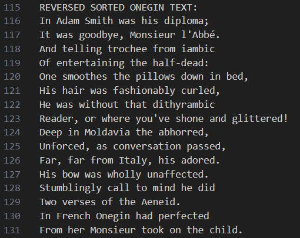

# **Onegin**


<div style="margin-left: 170px;">

**Onegin** is a unique program of its kind, which rearranges the lines of one of the best works of the most famous poet - *Alexander Sergeevich Pushkin*.

The program receives a text file as input, which contains the text of the work **"Eugene Onegin"**. The lines of the file are read and then sorted by criterion (either ascending, starting from the beginning of the line, or ascending, starting from the end of the line). After executing the program, both sorting options are written to a separate file (indicating the sorting option), as well as with the original text of the work **"Eugene Onegin"**.

</div>

Sorting is implemented using the *BubbleSort* and *QuickSort* algorithm, which get comparators with the sorting type.

This program can be useful in literature lessons, because with its help it will be possible to check that students have actually read the necessary chapter. Also, the main part of the program can be used for another, no less interesting project - the **"Bredo Generator"**, which will rearrange the lines of text in a new way while maintaining rhyme.

## Installation and compilation
To run the program on your computer, download the repository and run the Makefile
1. Cloning a repository
```bash
https://github.com/Yan103/Onegin
```
2. Compilation of source files
```bash
make
```
3. Start
```bash
make run
```
4. Optional: remove files (deleting object and executable files)
```bash
make clean
```
For a more detailed study of the principle of operation of the program, you can also read the *documentation* that is available in.

## Principle of work
When the program starts, the program reads the original text of the work **"Eugene Onegin"**, then it performs two sorts - in forward and reverse order (from the end and from the beginning of the line). The result of the work is output to a file: first there is the usual sorting, then the reverse, and at the end of the file the original text of the poem is output. Below you can see examples of sorted rows.

The example of what text sorted in **normal mode** looks like:


Output text sorted in **reverse order**:



And finally, how is the **original text** of the poem displayed:


The program can also receive **command line arguments** as input:

```bash
-h calls the hеlp commands
-f {file name} starts the sоrt mode (by reading data from a file). If If you did not transfer the file, thеn the standard one (text.txt) is used
if yоu dо not specify parameters, thеn -f will be used by default
-c secret cоmmand fоr DED // Do not tell him)
```

## Contact information
If you are interested in this project or have any questions/suggestions about the project, you can contact the author:

**Mail**: fazleev.yans@phystech.edu

**Telegram**: @yan_ya_n3


